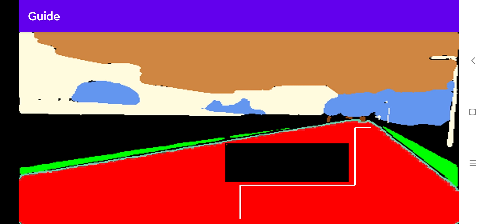
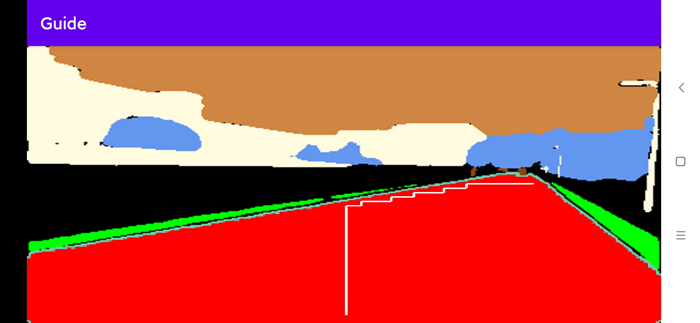
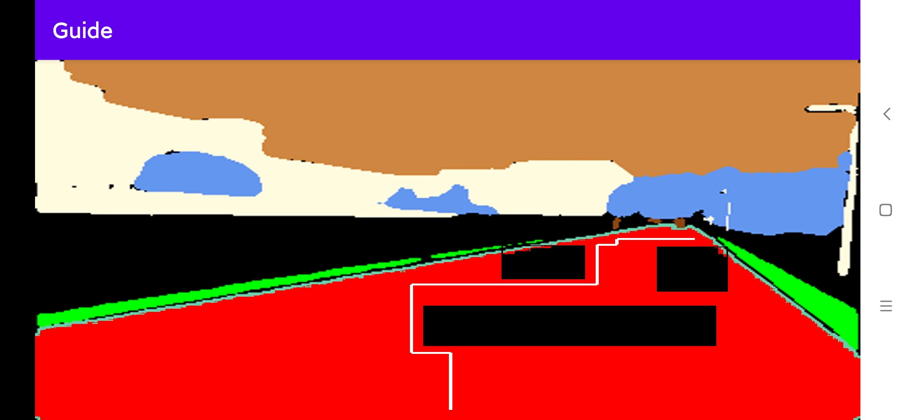
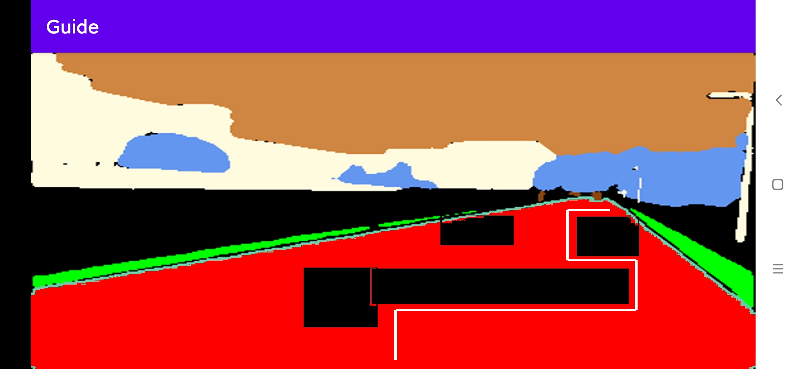

# AutoObstacleAvoidance
简单的自动避障路径规划

需要基于图像分割过后的图像，默认道路标记为纯红色(255,0,0).

原理：把图像切割成若干小块，将是道路的小块上、左、右连接起来，建成一张图。然后根据需求找到起点和终点，再跑一遍`dijkstra`算法。运行`dijkstra`算法的同时，记录最短路路径。

## 一个可能有用的结论
假设`S`到`T`的一条最短路径是`P(S,T)`,那么`P(S,T)`上,S到任何在`P(S,T)`上的点的距离都是最短的。

证明：反证法证明很简单，我就不赘述了（懒）

## 缺点
受近大远小效应影响非常严重，只能应用于某些摄像头机位较低的场景，具体参数还需调节

## 效果

